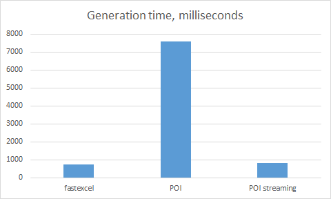
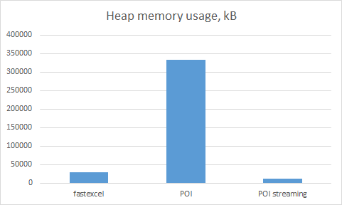

# fastexcel

[](https://travis-ci.org/dhatim/fastexcel)
[](https://coveralls.io/github/dhatim/fastexcel?branch=master)
[](https://maven-badges.herokuapp.com/maven-central/org.dhatim/fastexcel)
[](http://www.javadoc.io/doc/org.dhatim/fastexcel)

There are not many alternatives when you have to generate xlsx Excel workbooks in Java. The most popular one ([Apache POI](https://poi.apache.org/)) includes many features, but when it comes down to huge worksheets it quickly becomes a memory hog.

Its streaming API may mitigate this problem but it introduces several limitations:
- Its sliding window mechanism prevents you from accessing cells above the current writing position.
- It writes stuff to a temporary file.
- It comes with an overhead on the file size because shared strings are disabled by default. Enabling shared strings is likely to consume much more heap if you deal with string values.

So, fastexcel has been created to offer an alternative with the following key points:
- Limited set of features (basic style support, no graph support yet) and very simple API.
- Reduced memory footprint and high performance by accumulating only necessary elements. XML stuff is piped to the output stream at the end.
- Multithreading support: each worksheet in the workbook can be generated by a different thread, while fully supporting shared strings and styles.

## Benchmark

In this simple benchmark test, we generate a workbook with a single worksheet containing 100,000 rows and 4 columns.
Apache POI (non-streaming) is about 10 times slower than fastexcel and uses 12 times more heap memory.
The streaming API of Apache POI is almost on par with fastexcel in terms of performance and uses less heap just because it keeps only 100 rows in memory: see related limitations in the paragraph above.





Note heap memory usage is measured just before flushing the workbook to the output stream.


## Prerequisites

- Java 8. Build with Maven.
- Include the following dependency in your POM:
```xml
<dependency>
    <groupId>org.dhatim</groupId>
    <artifactId>fastexcel</artifactId>
    <version>0.9.0</version>
</dependency>
```

## Examples

The javadoc for the last release is available [here](http://www.javadoc.io/doc/org.dhatim/fastexcel).

### Simple workbook

Create a workbook with a single worksheet and a few cells with the different supported data types.

```java
try (OutputStream os = ...) {
    Workbook wb = new Workbook(os, "MyApplication", "1.0");
    Worksheet ws = wb.newWorksheet("Sheet 1");
    ws.value(0, 0, "This is a string in A1");
    ws.value(0, 1, new Date());
    ws.value(0, 2, 1234);
    ws.value(0, 3, 123456L);
    ws.value(0, 4, 1.234);
    wb.finish();
}
```

### Styles and formatting

Change cell style to bold with a predefined fill pattern:
```java
ws.style(0, 0).bold().fill(Fill.GRAY125).set();
```
Apply formatting to a cell containing a timestamp:
```java
ws.value(0, 0, LocalDateTime.now());
ws.style(0, 0).format("yyyy-MM-dd H:mm:ss").set();
```

### Cell ranges

Set style on a range of cells:
```java
ws.range(0, 0, 10, 10).style().horizontalAlignment("center").italic().set();
```
Merge cells:
```java
ws.range(0, 0, 10, 10).merge();
```
Shade alternate rows:
```java
ws.range(0, 0, 10, 10).style().shadeAlternateRows(Color.GRAY2).set();
```

### Formulas

Note the cells with a formula do not have a value in the generated workbook.
```java
ws.formula(10, 0, "=SUM(A1:A10)");
// With Range.toString():
ws.formula(10, 0, "=SUM(" + ws.range(0, 0, 9, 0).toString() + ")");
```
### Multithreaded generation

Each worksheet is generated by a different thread.
```java
try (OutputStream os = ...) {
    Workbook wb = new Workbook(os, "MyApplication", "1.0");
    Worksheet ws1 = wb.newWorksheet("Sheet 1");
    Worksheet ws2 = wb.newWorksheet("Sheet 2");
    CompletableFuture<Void> cf1 = CompletableFuture.runAsync(() -> {
        // Fill worksheet 1
        ...
    });
    CompletableFuture<Void> cf2 = CompletableFuture.runAsync(() -> {
        // Fill worksheet 2
        ...
    });
    CompletableFuture.allOf(cf1, cf2).get();
    wb.finish();
}
```
